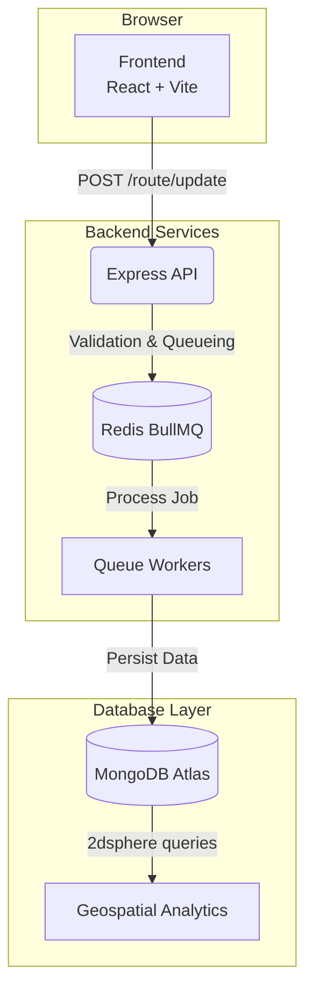

<div align="center">
  
  <h1 align="center">StreetPrint</h1>
  <p align="center">
    <strong>Location intelligence platform that transforms raw GPS telemetry into interactive travel coverage insights, route analytics, heatmaps, and personalized location recommendations.</strong>
  </p>
  <p align="center">
    <a href="https://streetprint.vercel.app">🌐 Live Demo</a> • 
    <a href="https://streetprint.onrender.com/api-docs">📄 API Docs</a>
  </p>
</div>

---


## Features

- **Real-time GPS route ingestion:** High-throughput coordinate processing.
- **Route reconstruction & history playback:** Lossless coordinate decoding and replay.
- **Heatmap generation:** Dynamic density visualization using geospatial bounding boxes.
- **Location recommendation engine:** Discovery features driven by OSM POI integration.
- **Redis-backed asynchronous processing:** Offloaded DB writes for massive scalability.
- **MongoDB geospatial analytics:** Fast 2dsphere proximity querying.
- **GPS noise filtering:** Real-time Kalman filtering and Haversine bounds checking.
- **Route compression using Polyline encoding:** Dramatic reduction in storage footprint.
- **Interactive Leaflet maps:** Fluid, offline-capable mapping with dynamic dark/light themes.

---

## Architecture



---

## System Architecture

### Data Ingestion Pipeline

1. **GPS coordinates arrive** at `/api/route/update` from mobile or web clients.
2. **Coordinates validated** strictly using Zod schemas for structural integrity.
3. **Noise filtered** using Haversine calculations to drop erratic points and duplicate nodes.
4. **Payload queued** directly into Redis via BullMQ, immediately freeing the API event loop.
5. **Workers persist** route data asynchronously to MongoDB, managing backpressure automatically.
6. **Geospatial analytics generated** asynchronously for heatmap rendering and location discovery.

---

## Performance

### Load Testing

**Environment:**
- Node.js (Express API)
- MongoDB Atlas
- Redis (BullMQ)
- K6 (Load Generator)

**Results:**

| Metric | Value |
|----------|----------|
| **P95 Ingestion Latency** | **2.94 ms** |
| Median Latency | 2.09 ms |
| Failed Requests | 0% |
| Successful Requests | 2,023 |
| Concurrent Users | 50 |

---

## Testing

- **100+ automated tests** using Jest and Vitest.
- **85%+ code coverage** across backend and frontend services.
- **Integration testing** for database, caching, and queuing logic.
- **Authentication testing** for secure JWT flows and user sessions.
- **Geospatial analytics testing** for heatmap clustering and coordinate filtering.
- **Queue processing validation** ensuring zero-loss async ingestion.


---

## Tech Stack

### Backend
- **Node.js & Express.js:** Fast, event-driven API layer.
- **TypeScript:** Strict type safety and robust refactoring.
- **MongoDB (Atlas):** Optimized for geospatial (`2dsphere`) querying.
- **Redis & BullMQ:** Distributed asynchronous job queuing.

### Frontend
- **React 18 & Vite:** Lightning-fast HMR and optimized builds.
- **Leaflet & React-Leaflet:** Highly customizable, interactive mapping.
- **IndexedDB & Service Workers:** True offline-first resilience.
- **Tailwind CSS & Framer Motion:** Fluid, glassmorphic UI.

### DevOps & Infrastructure
- **Docker & Docker Compose:** Containerized deployments.
- **GitHub Actions:** CI/CD pipeline for automated testing and registry builds.
- **Render:** Scalable backend hosting with private networking.
- **Vercel:** Global edge delivery for the SPA.

---

## Engineering Decisions

### Why Redis + BullMQ?
GPS updates arrive constantly from users in the field and should never block the API response loop. Using a queue-driven ingestion architecture decouples network request handling from database persistence, allowing the system to absorb massive bursts of traffic (proven by our 2.94ms P95 latency).

### Why MongoDB 2dsphere Indexes?
Traditional relational databases struggle with complex coordinate calculations at scale. MongoDB’s native `2dsphere` indexes allow for highly efficient proximity queries, bounding-box intersection for heatmap generation, and lightning-fast nearby POI discovery.

### Why Polyline Compression?
Routes containing hundreds or thousands of raw floating-point coordinates are incredibly heavy. We compress these arrays using Google's Polyline encoding algorithm before storage, drastically reducing database storage costs and network payload size upon retrieval.

---

## Local Development

```bash
# 1. Clone the repository
git clone https://github.com/Mohan14123/streetprint.git
cd streetprint

# 2. Install dependencies (Optional if using Docker)
npm install

# 3. Start the entire stack via Docker Compose
docker compose up --build

# Or run services manually:
# cd backend && npm run dev
# cd frontend && npm run dev
```

---

## API Examples

### Start a Route
```http
POST /api/route/start
Authorization: Bearer <token>
```
### Ingest GPS Coordinates
```http
POST /api/route/update
Authorization: Bearer <token>
Content-Type: application/json

{
  "routeId": "60d5ecb8...",
  "coordinates": [ [77.5946, 12.9716], [77.5948, 12.9718] ]
}
```
### Generate Heatmap
```http
GET /api/heatmap?bounds=12.9,77.5,13.0,77.6
Authorization: Bearer <token>
```

---

## Roadmap

- [ ] Prometheus monitoring & Grafana dashboards
- [ ] Route similarity detection (identifying overlapping paths)
- [ ] Geofence alerts and notifications
- [ ] Travel coverage scoring algorithm
- [ ] ML-based personalized recommendations (DBSCAN)
